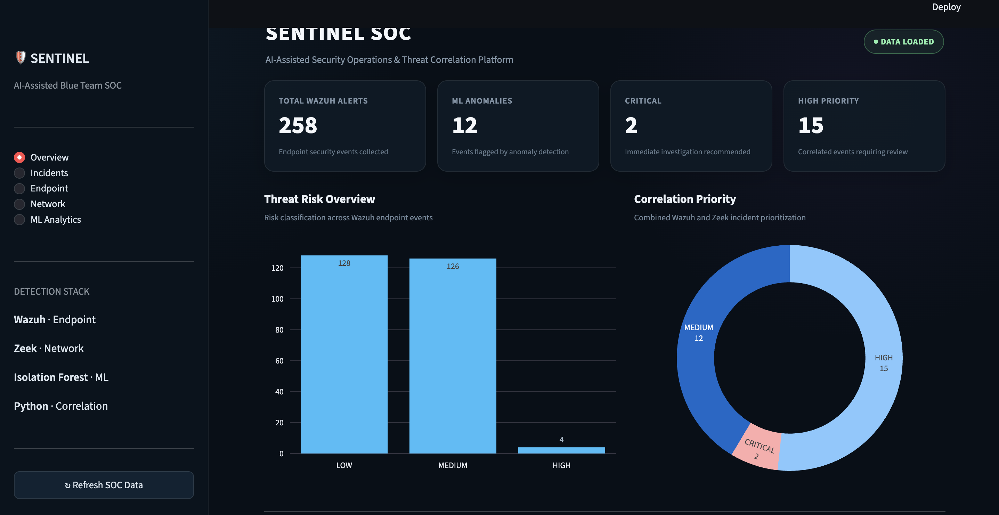
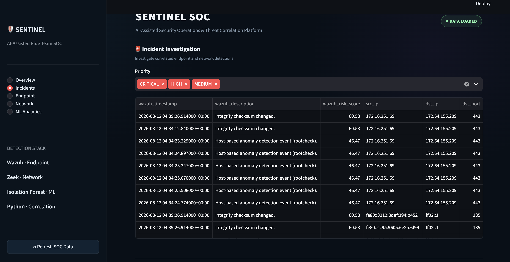
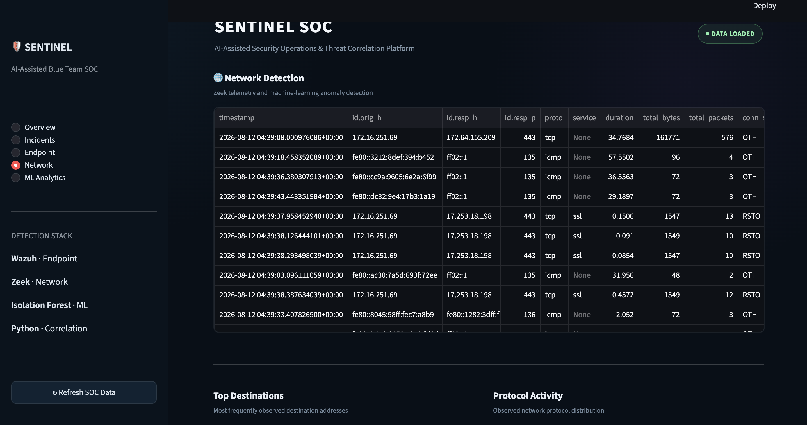

# 🛡️ Sentinel SOC

**AI-Assisted Blue Team Security Operations Platform**

Sentinel SOC is a cybersecurity lab project that combines endpoint telemetry, network monitoring, machine-learning-based anomaly detection, risk scoring, event correlation, visualization, and automated incident notification.

The platform uses **Wazuh** for endpoint security monitoring and **Zeek** for network telemetry, with Python-based Isolation Forest models identifying anomalous activity across both data sources.

---

## 🚀 Features

- Wazuh endpoint security monitoring
- File Integrity Monitoring (FIM)
- Vulnerability and security configuration monitoring
- Zeek network traffic analysis
- Endpoint anomaly detection using Isolation Forest
- Network anomaly detection using Isolation Forest
- Automated security risk scoring
- Wazuh + Zeek event correlation
- CRITICAL / HIGH / MEDIUM / LOW incident prioritization
- Interactive Streamlit SOC dashboard
- Automated email notification for CRITICAL incidents
- Stateful duplicate-alert suppression
- Automated SOC analysis pipeline

---

## 🏗️ Architecture

```text
                    SENTINEL SOC

              ┌──────────────────┐
              │      WAZUH       │
              │ Endpoint Monitor │
              └────────┬─────────┘
                       │
                       ▼
              Alert Collection
                       │
                       ▼
              Feature Engineering
                       │
                       ▼
              Isolation Forest
                       │
                       ▼
                 Risk Engine
                       │
                       │
                       ▼
                ┌─────────────┐
                │             │
                │ Correlation │
                │   Engine    │
                │             │
                └──────┬──────┘
                       ▲
                       │
                Network ML
                       ▲
                       │
              Feature Engineering
                       ▲
                       │
              ┌────────┴─────────┐
              │       ZEEK       │
              │ Network Monitor  │
              └──────────────────┘

                       │
                       ▼
               Incident Priority
                       │
                ┌──────┴───────┐
                ▼              ▼
          SOC Dashboard    Email Alerts
                           + Deduplication
```

---

## 🧠 Machine Learning

Sentinel SOC uses **Isolation Forest**, an unsupervised anomaly-detection algorithm.

This allows the system to identify unusual endpoint and network behaviour without requiring a fully labelled attack dataset.

### Endpoint features

Examples include:

- Wazuh rule severity
- Alert frequency
- Time of event
- File integrity activity
- Vulnerability events
- Security Configuration Assessment events
- Rootcheck events
- MITRE ATT&CK metadata

### Network features

Network telemetry is converted into behavioural features including:

- Connection duration
- Source and destination ports
- Bytes transferred
- Packet counts
- Protocol
- Service
- Connection state
- Bytes per packet
- Bytes per second
- Packet rate
- Source/destination traffic ratios
- Destination frequency
- Port frequency

---

## 🔗 Event Correlation

Endpoint and network detections are correlated to identify activity occurring within related time windows.

The correlation layer combines:

- Wazuh endpoint risk
- Endpoint anomaly score
- Zeek network anomaly score
- Temporal proximity
- Network metadata

The resulting incidents are assigned priorities such as:

```text
CRITICAL
HIGH
MEDIUM
LOW
```

This reduces the need to investigate endpoint and network telemetry independently.

---

## 📧 Automated Alerting

CRITICAL incidents can automatically generate an email notification through SMTP.

The alerting module includes **stateful duplicate suppression**, preventing an already-notified incident from generating another email every time the pipeline executes.

Credentials are supplied using environment variables and are not stored directly in source code.

---

## 📊 SOC Dashboard

The Streamlit dashboard provides a centralized view of:

- Wazuh alerts
- ML-detected anomalies
- Security risk distribution
- Correlated incidents
- Endpoint security events
- Zeek network anomalies
- Destination activity
- Incident priority
### Dashboard Preview

#### SOC Overview



#### Correlated Security Incidents



#### Network Anomaly Analysis


---

## ⚙️ Automated Pipeline

The analysis workflow can be executed using:

```bash
python ml/run_soc.py
```

The pipeline performs:

```text
Wazuh Alert Collection
        ↓
Endpoint Feature Engineering
        ↓
Endpoint ML Detection
        ↓
Risk Scoring
        ↓
Zeek Network ML Scoring
        ↓
Endpoint + Network Correlation
        ↓
Critical Email Alerting
```

---

## 🛠️ Technology Stack

| Component | Technology |
|---|---|
| SIEM / Endpoint Monitoring | Wazuh |
| Network Security Monitoring | Zeek |
| Programming | Python |
| Data Processing | Pandas / NumPy |
| Machine Learning | Scikit-learn |
| ML Algorithm | Isolation Forest |
| Visualization | Streamlit / Plotly |
| Alerting | SMTP |
| Containerization | Docker |
| Version Control | Git |

---

## 📁 Project Structure

```text
BlueTeam-SOC/
│
├── dashboard/
│   └── app.py
│
├── ml/
│   ├── fetch_alerts.py
│   ├── feature_engineering.py
│   ├── train_model.py
│   ├── risk_engine.py
│   ├── score_zeek_capture.py
│   ├── correlate_events.py
│   ├── email_alerts.py
│   └── run_soc.py
│
├── docs/
│   └── screenshots/
│
├── .gitignore
├── requirements.txt
└── README.md
```

Generated datasets, trained model artifacts, credentials, certificates, packet captures, and local logs are excluded from version control.

---

## 🔐 Security

Sensitive information should never be committed to the repository.

The project uses environment variables for credentials such as:

```text
WAZUH_INDEXER_USER
WAZUH_INDEXER_PASS
SOC_EMAIL_USER
SOC_EMAIL_PASSWORD
SOC_EMAIL_TO
```

The repository's `.gitignore` excludes local credentials, generated datasets, ML model files, Wazuh certificates, Zeek captures, and other runtime artifacts.

---

## ⚠️ Project Scope

Sentinel SOC is a **portfolio/lab security monitoring platform**, not a production SOC replacement.

The machine-learning models identify statistical anomalies, which do not automatically represent malicious activity. Detections require analyst investigation and contextual validation.

A production deployment would require additional model validation, baselining, authentication, secure secret management, scalable data ingestion, alert tuning, and continuous monitoring.

---

## 🔮 Future Improvements

Potential extensions include:

- Threat-intelligence enrichment
- MITRE ATT&CK mapping
- Automated IOC reputation checks
- Case-management integration
- Additional detection models
- Multi-endpoint monitoring
- Real-time network ingestion
- Analyst investigation workflows

---

## 👤 Author

**Chinmay Pagare**

Cybersecurity / Blue Team Portfolio Project
